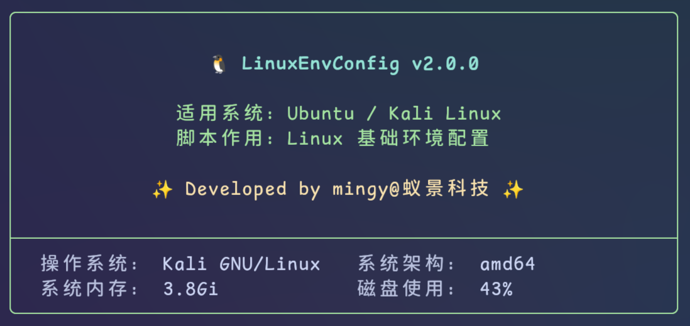
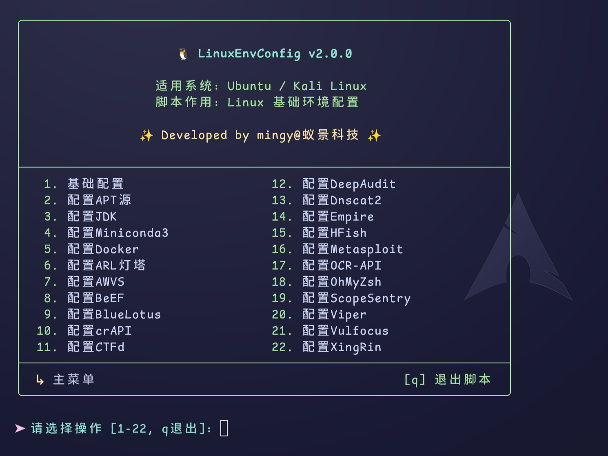

# LinuxEnvConfig (LEC)

[](https://gitee.com/yijingsec/LinuxEnvConfig)
[](https://gitee.com/yijingsec/LinuxEnvConfig)
[](http://www.apache.org/licenses/LICENSE-2.0)

Ubuntu/Kali Linux基础环境与安全工具自动化配置脚本。项目已完全重构为全新的 **v2.0模块化架构**，提供了更优雅的交互体验与更便捷的扩展机制。



---

## 🚀 快速开始

### 方式一：全局一键命令（推荐）

您可以通过一行命令获取 `install.sh` 脚本并直接执行，快速将项目注册为全局命令。安装完成后，在终端任何工作目录下直接输入 `lec` 即可快捷启动菜单：

使用 `curl` 命令：
```bash
curl -sSL https://gitee.com/yijingsec/LinuxEnvConfig/raw/master/install.sh | sudo bash
```

或者使用 `wget` 命令：
```bash
wget -qO- https://gitee.com/yijingsec/LinuxEnvConfig/raw/master/install.sh | sudo bash
```

### 方式二：本地克隆运行

如果您想把项目克隆到本地直接运行：

```bash
git clone https://gitee.com/yijingsec/LinuxEnvConfig.git
cd LinuxEnvConfig
sudo bash main.sh
```

---

## 📊 版本对比

| 特性 | 模块化版本 (`main.sh` / `lec`) | 经典单体版 (`v1`分支) |
|------|--------------------------------|-------------------------|
| **系统架构** | 模块化设计 (`main.sh` + `lib/` + `modules/`) | 单个巨大脚本文件 |
| **快捷启动** | 支持通过 `install.sh` 注册全局指令 `lec` | 仅支持直接运行脚本文件 |
| **菜单级别** | 支持无限层级菜单嵌套，可随时返回上级菜单 | 仅单级平面菜单，返回直接退回主菜单 |
| **界面交互** | 边框标题、自动对齐多列菜单、流式状态指示器 | 简易的纯文本列表输出 |
| **扩展能力** | 放入 `modules/` 目录下即可自动加载，无需改动核心代码 | 需频繁修改和维护 3400+ 行的主文件 |
| **升级机制** | 支持Git安全检测、分支过滤、兼容无 `jq` 降级正则检测 | 基础的拉取更新 |
| **运行日志** | 引入容器拉取双行静默刷新渲染，屏蔽刷屏冗余日志 | 原始的 Docker 命令行日志滚动 |

---

## ⏪ 经典单体版（旧版本兼容）

为使主分支目录结构更加纯净，原单文件脚本 `LinuxEnvConfig.sh` 已迁移至独立的 **`v1`分支** 进行维护。主分支 (master) 现仅存放当前的 v2.0 模块化版本。

如果您仍需要使用之前的经典单体版脚本，请通过以下命令切换分支进行部署：

```bash
# 克隆 v1 分支代码
git clone -b v1 https://gitee.com/yijingsec/LinuxEnvConfig.git

# 运行单体配置脚本
cd LinuxEnvConfig
sudo bash LinuxEnvConfig.sh
```

---

## ✨ v2.0 模块化新特性

- **全局快捷命令**：支持一键将项目安装到系统中，生成 `lec` 全局命令，开箱即用。
- **多级菜单与面包屑**：提供清晰的面包屑路径，例如 `主菜单 > 基础配置 > 配置DNS`，操作后自动停留在当前菜单。
- **自适应多列菜单**：根据终端的实际宽度自动调整菜单列数排版，界面紧凑优雅。
- **纯净式拉取渲染**：容器拉取与 Docker Compose 编排深度集成了双行覆盖刷新指示器，免受滚动刷屏干扰。
- **智能防覆盖更新**：
  - 自动规避 `safe.directory` 造成的 root 权限 Dubious Ownership 所有权报错。
  - 自动检测工作分支，非 `master` 分支绕过自动更新，保护本地代码。
  - 兼容无 `jq` 工具的环境，自动降级为正则匹配获取远程标签。

---

## 🛠️ 模块与功能目录

项目目前拥有 **22个核心模块**。各模块均由独立的 `.sh` 脚本进行管理：

```
LinuxEnvConfig/
├── main.sh                 # 主入口脚本
├── install.sh              # 一键全局命令注册脚本
├── lib/                    # 核心公共库
│   ├── common.sh           # ANSI颜色、消息输出、UI布局与进度条
│   ├── core.sh             # 操作系统检测、全局变量与环境校验
│   ├── io.sh               # 用户交互、输入验证与密码读取
│   ├── menu.sh             # 多级菜单框架与调度系统
│   ├── network.sh          # 网络连通性测试、镜像源检测与项目自动更新
│   └── utils.sh            # 软件包/Docker/Compose/备份管理通用生命周期函数
└── modules/                # 22个功能配置模块（按需自动加载）
```



### 1. 基础配置 (`basic.sh`)
系统底层基础选项配置：
- **启用ROOT用户**：支持修改 ROOT 密码，解除 root 用户锁定。
- **启用SSH服务**：自动安装并启动 OpenSSH-Server，配置系统开机自启。
- **允许ROOT用户SSH登录**：自动配置并应用 `/etc/ssh/sshd_config`。
- **设置DNS名称服务器**：支持自动选择最快 DNS 或手动输入，支持 DNS 配置的备份与还原。
- **查看网络接口信息**：快速获取主机所有物理网卡、IP 地址、掩码与网关。
- **解除DNS的53端口占用**：清理 systemd-resolved 服务的端口占用，释放 53 端口。

### 2. 配置APT源 (`apt.sh`)
配置 Ubuntu/Kali 系统的 APT 安装源：
- **自动选择最快镜像**：并发测试并自动应用响应时间最快的镜像。
- **手动选择镜像源**：可手动切换为：阿里云、腾讯云、华为云、清华大学、中科大或恢复为官方 APT 源。
- **APT源备份管理**：提供配置恢复、备份清理等生命周期管理。

### 3. 配置JDK (`jdk.sh`)
企业级 Java 运行时环境配置：
- **安装 OracleJDK**：支持 Oracle JDK 8 / 11 / 17 / 21 / 22 / 23 等 LTS/最新版本的下载与环境变量配置。
- **安装 OpenJDK**：支持 OpenJDK 11 / 17 / 21 / 22 / 23 版本，支持通过 APT 自动安装或镜像源二进制部署。
- **删除当前JDK环境**：一键清除系统中通过本脚本安装的 JDK 环境与环境变量。

### 4. 配置Miniconda3 (`miniconda3.sh`)
轻量级 Python 科学计算虚拟环境管理：
- **安装 Miniconda3**：支持选择哈工大、北大、清华、浙大、南大等国内高速镜像源或官方源进行安装。
- **卸载 Miniconda3**：一键清理 Conda 目录与环境变量。
- **配置软件源**：一键为 Conda 配置国内镜像源加速下载。

### 5. 配置Docker (`docker.sh`)
轻量级容器云平台生命周期管理：
- **安装Docker系统**：自动安装 Docker 社区版 (Docker CE)，支持选择清华、北大、阿里、华为、腾讯等安装源。
- **卸载Docker系统**：完全卸载 Docker 相关组件并清理目录。
- **Docker镜像加速源**：配置或查看、移除国内 Docker 镜像加速节点。
- **配置Docker网络代理**：支持为 Docker 服务配置 HTTP/HTTPS、SOCKS5 代理。
- **独立版Docker Compose**：支持从 Gitee 镜像或 Github 官方源安装、卸载独立版 `docker-compose`。

### 6. 配置Vulfocus ([GitHub](https://github.com/fofapro/vulfocus)) (`vulfocus.sh`)
Vulfocus 漏洞测试平台：
- **功能选项**：支持一键安装、停止、启动与完全卸载 Vulfocus 靶场系统。

### 7. 配置ARL灯塔 ([GitHub](https://github.com/TophantTechnology/ARL)) (`arl.sh`)
ARL 资产侦察灯塔系统：
- **功能选项**：支持一键安装、启动、停止和完全卸载 ARL 资产扫描系统。
- **附加组件**：支持一键添加优化扫描指纹库。

### 8. 配置Metasploit ([GitHub](https://github.com/rapid7/metasploit-framework)) (`metasploit.sh`)
Metasploit-framework 渗透测试平台：
- **功能选项**：支持一键在系统中安装最新版 MSF，或对其进行彻底卸载。

### 9. 配置Viper ([GitHub](https://github.com/FunnyWolf/Viper)) (`viper.sh`)
Viper 图形化红队会话管理与渗透测试平台：
- **功能选项**：支持一键安装、更新版本、重置管理员密码、启动、关闭及完全卸载 Viper。

### 10. 配置Empire ([GitHub](https://github.com/BC-SECURITY/Empire)) (`empire.sh`)
Empire 后渗透测试框架（已整合 Starkiller 前端）：
- **功能选项**：支持拉取并安装 Empire (服务端及内置配置)、更新镜像、启动、关闭与彻底卸载 Empire。

### 11. 配置Dnscat2 ([GitHub](https://github.com/iagox86/dnscat2)) (`dnscat2.sh`)
基于 DNS 协议的加密 C2 隧道：
- **功能选项**：支持下载 dnscat2 容器镜像，一键启动直连模式或中继模式。

### 12. 配置BeEF ([GitHub](https://github.com/beefproject/beef)) (`beef.sh`)
BeEF 浏览器漏洞利用与渗透测试框架：
- **功能选项**：支持一键基于 Docker 安装、启动、停止和完全卸载 BeEF。

### 13. 配置BlueLotus ([GitHub](https://github.com/firesunCN/BlueLotus_XSSReceiver)) (`bluelotus.sh`)
BlueLotus_XSSReceiver 蓝莲花 XSS 漏洞测试与数据接收平台：
- **功能选项**：支持一键部署、启动、停止和卸载 BlueLotus 平台。

### 14. 配置HFish ([GitHub](https://github.com/hacklcx/HFish)) (`hfish.sh`)
HFish 分布式主动防御蜜罐系统：
- **功能选项**：支持一键安装 HFish、在线升级、启动、停止、卸载以及获取 SQLite 数据库信息。

### 15. 配置CTFd ([GitHub](https://github.com/CTFd/CTFd)) (`ctfd.sh`)
CTFd 夺旗赛靶场竞赛框架：
- **功能选项**：支持一键基于容器快速部署、启动、关闭和卸载 CTFd 竞赛管理平台。

### 16. 配置AWVS ([官网](https://www.acunetix.com)) (`awvs.sh`)
AWVS 自动化 Web 应用漏洞扫描器：
- **功能选项**：支持一键安装、启动、停止与完全卸载 AWVS 扫描器。

### 17. 配置OCR-API ([GitHub](https://github.com/sml2h3/ddddocr)) (`ocr-api.sh`)
基于 ddddocr 的超简易验证码与文字识别 OCR 服务：
- **功能选项**：支持一键安装、停止、启动和卸载 OCR 服务（提供 Web API 接口）。

### 18. 配置OhMyZsh ([GitHub](https://github.com/ohmyzsh/ohmyzsh)) (`ohmyzsh.sh`)
Zsh终端美化与效率框架：
- **功能选项**：安装 Oh My Zsh，支持切换为常用的 `ys` 终端主题，以及一键配置 `zsh-autosuggestions` (自动补全) 与 `zsh-syntax-highlighting` (语法高亮) 插件。

### 19. 配置crAPI ([GitHub](https://github.com/OWASP/crAPI)) (`crapi.sh`)
OWASP 官方推出的 crAPI 脆弱性 API 演练靶场：
- **功能选项**：支持通过 Docker Compose 一键拉取并安装、停止、启动与卸载 crAPI 服务。

### 20. 配置XingRin ([GitHub](https://github.com/yyhuni/xingrin)) (`xingrin.sh`)
XingRin 分布式微服务自动化漏洞与配置合规扫描平台：
- **功能选项**：支持一键拉取容器并完成分布式安装、卸载、启动、停止以及实时查看邢人服务状态。

### 21. 配置DeepAudit ([GitHub](https://github.com/lintsinghua/deepaudit)) (`deepaudit.sh`)
DeepAudit 源代码与深度漏洞安全审计分析系统：
- **功能选项**：支持一键容器化部署、停止、启动、卸载 DeepAudit，支持实时查看服务容器状态。

### 22. 配置ScopeSentry ([GitHub](https://github.com/Autumn-27/ScopeSentry)) (`scopesentry.sh`)
ScopeSentry 分布式敏感资产与网络暴露面侦察管理系统：
- **功能选项**：支持一键基于 Docker 进行多节点安装、完全卸载、启动、关闭、查看状态以及重置 ScopeSentry 管理员密码。

---

## 🛠️ 模块化开发指南

您可以极其简单地为本项目增加新的配置功能。所有模块都是动态加载的，只需在 `modules/` 目录下添加一个 Shell 脚本。

### 编写规范
1. **文件头部规范**：使用标准文件头部，说明版权与模块描述。
2. **避免行内注释与参数级 doc 声明**：代码应采用自解释的命名方式，仅允许使用 Stylized 分隔符（如 `# ══════`）来分隔主要逻辑块。
3. **调用组件库函数**：优先复用 `lib/utils.sh` 中提供的现成操作，例如 `prompt_host_ip`（输入IP并验证）、`show_access_info`（格式化面板输出）、`docker_stop_container` 等。
4. **中英文排版**：所有输出字符串，中英文之间**不允许有空格**。

### 模板示例
新建 `modules/custom.sh`：

```bash
#!/usr/bin/env bash
#
# Copyright 2026 Hunan Yijing Technologies Co., Ltd
#
# Licensed under the Apache License, Version 2.0 (the "License");
# ...

# ━━━━━━━━━━━━━━━━━━━━━━━━━━━━━━━━━━━━━━━━━━━━━━━━━━━━━━━━━━━━━━━
#  📝 模块描述 : 示例自定义工具配置模块
#  📁 文件路径 : modules/custom.sh
#  👤 作者信息 : mingy
# ━━━━━━━━━━━━━━━━━━━━━━━━━━━━━━━━━━━━━━━━━━━━━━━━━━━━━━━━━━━━━━━

config_custom() {
    while true; do
        show_submenu "自定义配置" \
            "安装Custom工具" \
            "启动Custom工具" \
            "停止Custom工具" \
            "卸载Custom工具"

        local choice
        msg_prompt "请选择操作 [0-4, q退出]"

        case $choice in
            0) return ;;
            q|Q) exit 0 ;;
            1) install_custom ;;
            2) start_custom ;;
            3) stop_custom ;;
            4) remove_custom ;;
            *) msg_error "无效选择" ;;
        esac

        pause
    done
}

install_custom() {
    show_section "安装Custom工具"
    # 业务逻辑代码
    msg_success "Custom工具安装成功"
}

# 注册到主菜单中
register_main_menu "配置Custom" "config_custom"
```

---

## 📝 开源许可证

本项目基于 [Apache License 2.0](LICENSE) 许可证开源。