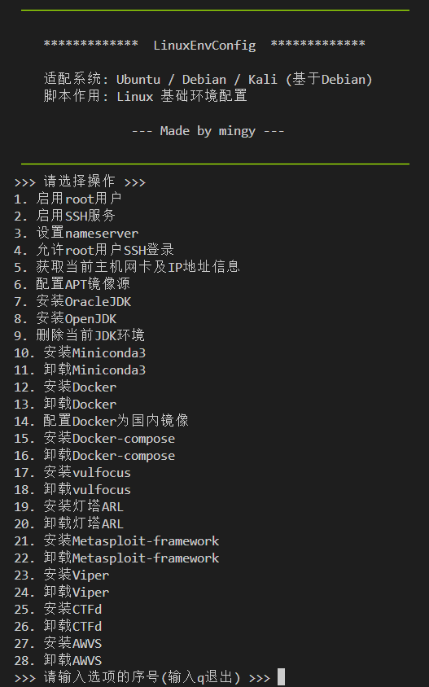

# LinuxEnvConfig

Ubuntu / Debian / Kali Linux 基础环境配置脚本

```
 ─────────────────────────────────────────────────────

    *************  LinuxEnvConfig  *************

    适配系统: Ubuntu / Debian / Kali (基于Debian)
    脚本作用: Linux 基础环境配置

                --- Made by mingy ---

 ─────────────────────────────────────────────────────
```

## 使用

```bash
git clone https://gitee.com/yijingsec/LinuxEnvConfig.git

cd LinuxEnvConfig

sudo bash LinuxEnvConfig.sh
```



## 功能

1. 基础配置
2. 配置 APT
3. 配置 JDK
4. 配置 Miniconda3
5. 配置 Docker
6. 配置 Docker-compose
7. 配置 Vulfocus
8. 配置 ARL
9. 配置 Metasploit-framework
10. 配置 Viper
11. 配置 Empire
12. 配置 Starkiller
13. 配置 Dnscat2
14. 配置 Beef
15. 配置 Bluelotus
16. 配置 HFish
17. 配置 CTFd
18. 配置 AWVS
19. 配置 ocr_api_server
20. 配置 oh-my-zsh

### 基础配置

1. 启用ROOT用户
2. 启用SSH服务
3. 允许ROOT用户SSH登录
4. 设置NameServer
5. 获取当前主机网卡及IP地址信息
6. 解除DNS协议53端口占用
7. 返回主菜单

### 配置 APT


### 配置 JDK

1. 安装 OracleJDK
2. 安装 OpenJDK
3. 删除当前JDK环境
4. 返回主菜单

#### 安装 OracleJDK

1. Oracle JDK 8 LTS
2. Oracle JDK 11 LTS
3. Oracle JDK 17 LTS
4. Oracle JDK 21 LTS
5. Oracle JDK 22 LTS
6. Oracle JDK 23 LTS
7. 返回主菜单

#### 安装 OpenJDK

1. OpenJDK 11 LTS
2. OpenJDK 17 LTS
3. OpenJDK 21 LTS
4. OpenJDK 22 LTS
5. OpenJDK 23 LTS
6. 返回到主菜单

### 配置 Miniconda3

1. 安装 Miniconda3
2. 卸载 Miniconda3
3. 配置 Miniconda3 软件源
4. 返回主菜单

### 配置 Docker

1. 安装 Docker
2. 卸载 Docker
3. 配置 Docker 国内镜像
4. 获取 Docker 国内镜像源配置
5. 取消 Docker 国内镜像
6. 配置 Docker 网络代理
7. 获取 Docker 网络代理配置
8. 取消 Docker 网络代理
9. 更新 Docker 镜像源列表
10. 拉取 Docker 镜像
11. 返回主菜单

### 配置 Docker-compose

1. 安装 Docker-compose
2. 卸载 Docker-compose
3. 返回主菜单

### 配置 Vulfocus

1. 安装 Vulfocus
2. 卸载 Vulfocus
3. 返回主菜单

### 配置 ARL

1. 安装 ARL
2. 停止 ARL
3. 启动 ARL
4. 卸载 ARL
5. 添加指纹
6. 返回主菜单

### 配置 Metasploit-framework

1. 安装 Metasploit-framework
2. 卸载 Metasploit-framework
3. 返回主菜单

### 配置 Viper

1. 安装 Viper
2. 更新 Viper版本
3. 更新 Viper密码
4. 启动 Viper
5. 关闭 Viper
6. 卸载 Viper
7. 返回主菜单

### 配置 Empire

1. 安装 Empire
2. 更新 Empire
3. 启动 Empire
4. 关闭 Empire
5. 卸载 Empire
6. 返回主菜单

### 配置 Starkiller

1. 安装 Starkiller
2. 更新 Starkiller
3. 关闭 Starkiller
4. 启动 Starkiller
5. 卸载 Starkiller
6. 返回主菜单

### 配置 Dnscat2

1. 安装 Dnscat2
2. 启动 Dnscat2 (直连模式)
3. 启动 Dnscat2 (中继模式)
4. 返回主菜单

### 配置 Beef

1. 安装 Beef
2. 关闭 Beef
3. 启动 Beef
4. 卸载 Beef
5. 返回主菜单

### 配置 Bluelotus

1. 安装 Bluelotus
2. 关闭 Bluelotus
3. 启动 Bluelotus
4. 卸载 Bluelotus
5. 返回主菜单

### 配置 HFish

1. 安装 HFish
2. 更新 HFish
3. 关闭 HFish
4. 启动 HFish
5. 卸载 HFish
6. 获取数据库信息
7. 返回主菜单

### 配置 CTFd

1. 安装 CTFd
2. 卸载 CTFd
3. 返回主菜单

### 配置 AWVS

1. 安装 AWVS
2. 卸载 AWVS
3. 返回主菜单

### 配置 ocr_api_server

1. 安装 ocr_api_server
2. 卸载 ocr_api_server
3. 返回主菜单

### 配置 oh-my-zsh

1. 安装 oh-my-zsh
2. 更新 oh-my-zsh
3. 卸载 oh-my-zsh
4. 配置 oh-my-zsh 主题
5. 配置 oh-my-zsh 插件
6. 返回主菜单